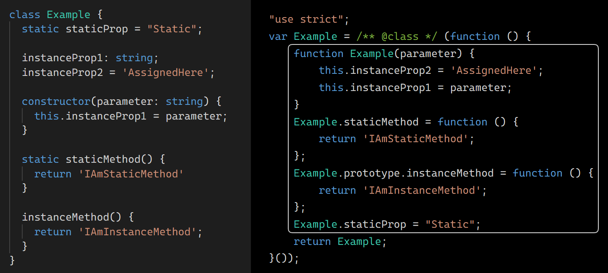

import TOCInline from '@theme/TOCInline';

<TOCInline toc={toc} />

## Qué son los miembros estáticos de una clase

Seguramente ya sabes que una clase en TypeScript y JavaScript puede tener
*miembros estáticos*, definidos con la palabra clave `static`. Así como las
propiedades y métodos normales pertenecen o se aplican a cada una de las
*instancias* de la clase, **las propiedades y métodos estáticos no pertenecen a
ninguna instancia particular sino *a la clase* en su conjunto**.

Las propiedades estáticas pueden ser útiles para almacenar constantes y datos de
configuración vinculados a una clase. Los métodos, por su parte, pueden efectuar
operaciones que no son propias de una instancia puntual, como comparar dos
instancias diferentes u operar con ellas.

Podemos analizar esta diferencia con el siguiente ejemplo. Definimos una clase
para construir vectores bidimensionales. Cada instancia de un vector tiene sus
propias propiedades y métodos: `x`, `y` y `getMagnitude`. A su vez, la clase
posee el método estático `sum` para sumar una cantidad indefinida de vectores
bidimensionales.

```ts
class Vector2D {
  constructor(
    public readonly x: number, 
    public readonly y: number
  ) { }

  public static sum(...vectors: Vector2D[]): Vector2D {
    const coords = vectors.reduce((totals, vector) => {
      totals.x += vector.x;
      totals.y += vector.y;
      
      return totals;
    }, {x: 0, y: 0});

    return new this(coords.x, coords.y);
  }

  public getMagnitude(): number {
    return Math.hypot(this.x, this.y);
  }
}
```

Los siguientes usos de esta clase muestran que mientras el método estático `sum`
se invoca desde la clase, el método de instancia `getMagnitude` corresponde a
cada vector particular:

```ts
const vector1 = new Vector2D(3, 4);
const vector2 = new Vector2D(2, -3);
const sumOfVectors = Vector2D.sum(vector1, vector2);
vector1.getMagnitude();                                 // 5
vector2.getMagnitude();                                 // 3.60555...
sumOfVectors.getMagnitude();                            // 5.09901...
```

## Por qué una interfaz para miembros estáticos

Nos planteamos ahora el siguiente problema: debemos **definir una serie de
clases que deben compartir una misma interfaz para sus miembros estáticos**.
Para comprender mejor el problema lo abordaremos con algunos casos de uso.

Supongamos que estamos desarrollando un juego, donde una de las entidades es el
monstruo, representada mediante la clase madre (o interfaz) `Monster`. Hay
distintos tipos de monstruos, construidos cada uno mediante una clase hija de
`Monster` (o que implementa la interfaz `Monster`): `Orc`, `Zombie`, `Dragon`...
Supongamos, por último, que cada una de estas clases hijas debe implementar una
propiedad estática `maxAmount`, la cual representa la cantidad máxima de
monstruos de un tipo determinado que puede ser instanciada para un escenario
particular.

Uno podría sin más implementar la propiedad `maxAmount` en cada una de las
clases hijas:

```ts
class Orc {
  static maxAmount = 4;
}

class Zombie {
  static maxAmount = 8;
}

// ...
```

Sin embargo, esto tiene una serie de desventajas:

1. El programador debe recordar para cada clase los miembros estáticos que debe
   implementar y sus tipos. Mientras más miembros estáticos haya que
   implementar aumentan las probabilidades de olvidar alguno o de implementarlos
   incorrectamente.
2. Si `maxAmount`cambia de nombre o de tipo, o se añaden nuevos miembros
   estáticos que todas las clases deben satisfacer, la actualización de las
   clases se realiza una por una al igual que en el punto anterior. El
   programador podría equivocarse al actualizar las clases "manualmente" (podría
   olvidar algunas clases o realizar incorrectamente alguna actualización).
3. Las clases en JavaScript y TypeScript, además de definir tipos, también son
   valores susceptibles de ser manipulados programáticamente. TypeScript no
   permitirá algunas operaciones con dichas clases si no sabe, por ejemplo, que
   pueden contener la propiedad estática `maxAmount`.

Estas desventajas se resumen en el hecho de que **hay una estructura común que
puede ser abstraída de todas estas clases y se está perdiendo la oportunidad de
explotar el potencial de esta abstracción**.

Podemos representar la parte estática de las clases correspondientes a los tipos
de monstruos mediante una interfaz:

```ts
interface MonsterStatic {
  maxAmount: number;
}
```

Lo que necesitamos es una forma de que TypeScript controle que todas las clases
que hereden la clase (o implementen la interfaz) `Monster` contengan como
miembros estáticos los miembros de `MonsterStatic`. Al definir estas clases
queremos poder especificar que su parte estática implementa `MonsterStatic`.
Esto se expresaría así en pseudo-código:

```ts
class Orc cuya parte estática implementa MonsterStatic {
  // ...
}
```

De aquí en más, para abstraernos de nuestro caso de uso, **nos referiremos a
`MonsterStatic` como *interfaz estática* y a las clases cuya parte estática
es representada por dicha interfaz como *clases representadas***.

Esta posibilidad de referir los miembros estáticos de varias clases a una misma
interfaz estática elimina las anteriores desventajas:

1. El programador ya no debe recordar para cada clase representada los miembros
   estáticos que debe implementar y sus tipos, sino que **debe limitarse a
   especificar que la parte estática de dichas clases implementa una interfaz
   estática. TypeScript se encargará de reclamar que se implementen los miembros
   contenidos en ella**.
2. **Si se produce una modificación en la interfaz estática, TypeScript exigirá
   actualizar los miembros de todas las clases representadas que la
   implementan**. Cualquier inconsistencia será detectada inmediatamente por el
   compilador.
3. **La interfaz estática puede ser usada para especificar el tipo de las
   variables que se usen para referir a las clases representadas**. Esto
   facilita el uso de esas clases como valores y su manipulación programática.
   Por ejemplo:

  ```ts
  function createMonsters(classes: MonsterStatic[]) {
    const monsters: Monster[] = [];

    for (const monsterClass of classes) {
      for (let i = 0; i < monsterClass.maxAmount; i++) {
        monsters.push(new monsterClass());
      }
    }

    return monsters;
  }
  ```

:::info El tipo de una clase en cuanto objeto

Las clases en JavaScript [son objetos de primera
clase](https://en.wikipedia.org/wiki/First-class_citizen), pueden ser valores de
variables y ser representados por tipos en TypeScript. Para comprender cómo se
representan las clases por tipos en TypeScript puede ser útil mostrar qué son
exactamente las clases en cuanto objetos en JavaScript. Una forma sencilla de
verlo es analizando el resultado de transpilar una clase de TypeScript a
EcmaScript 5:


600px
:::

Planteado así el problema, primero mostraremos distintas estrategias para
construir y aplicar esta interfaz estática, y al final del artículo
presentaremos un caso de uso más realista.

## Cinco abordajes del problema

Ensayaremos ahora cinco intentos para especificar que un grupo de clases
implementa una interfaz estática. Los primeros dos representan enfoques
intuitivos que no llegan a cumplir con nuestros requerimientos o fracasan por
limitaciones en la sintaxis de TypeScript. Los otros tres intentos representan
soluciones correctas pero con distintas desventajas.

### 1. Interfaz estática implementada en una clase madre

**Una forma intuitiva de abstraer funcionalidad común entre diferentes clases es
utilizando el mecanismo de *herencia***. Podríamos intentar implementar
`MonsterStatic` en la clase madre `Monster`, y hacer que las clases
representadas hereden la interfaz estática de esta clase madre.

**JavaScript y TypeScript permiten la herencia de propiedades y métodos
estáticos**. Su mecanismo es análogo a la herencia de miembros de instancia: si
no están implementados para la clase hija, se los busca en la clase madre. Por
ejemplo:

```ts
class Monster {
  static maxAmount = 2;
}

class Orc extends Monster { }

class Zombie extends Monster {
  static maxAmount = 5;
}

Orc.maxAmount;          // 2
Zombie.maxAmount;       // 5
```

Sin embargo, esta forma de herencia no nos sirve para nuestro caso de uso, ya
que el valor de la propiedad `maxAmount` es especial para cada una de las clases
representadas, por lo que no puede especificarse en la clase madre. Esta
solución **sólo es útil en casos donde no requerimos que las clases hijas
implementen miembros estáticos diferentes a los de la clase madre, p. ej. si hay
métodos estáticos heredados no polimórficos (con una única implementación)**.

Uno podría intentar mantener este esquema de solución **recurriendo a las
*clases abstractas*, que no existen en JavaScript pero sí en TypeScript**. Así,
`Monster` se definiría como una clase abstracta, que contendría a `maxAmount`
como propiedad estática abstracta. Como ocurre con los miembros no estáticos
abstractos, cada clase que herede de `Monster` debería contener una
implementación de `maxAmount`, cumpliendo el objetivo que nos proponemos.

Sin embargo, por el momento **TypeScript no permite que los miembros estáticos
de una clase sean abstractos**. [En el repositorio de TypeScript hay una
discusión abierta en torno a la posibilidad de incluir esta funcionalidad dentro
del lenguaje](https://github.com/microsoft/TypeScript/issues/34516), pero aun no
parece estar en vías de resolución.

### 2. Interfaz estática incluida en una interfaz implementada por las clases representadas

Las *interfaces* son otro tipo de abstracción que pueden representar elementos
comunes a diversas clases y objetos. A diferencia de una clase madre, **una
interfaz no puede implementar ninguna funcionalidad: no puede establecer ningún
valor o implementación para sus miembros, sino sólo especificar *sus tipos***.
Esta especificación representa un "contrato" que las diversas clases que lo
implementan deben cumplir: los nombres y los tipos que deben tener determinados
miembros de dichas clases. Otras partes del código luego pueden contentarse con
saber que están interactuando con una entidad que implementa dicho contrato (p.
ej., saber que pueden llamar a determinado método y obtener determinado tipo de
valor) sin acoplarse con ninguna implementación particular del mismo.

Podemos intentar definir una interfaz a ser implementada por las clases
representadas, incluyendo en ella nuestra interfaz estática. El resultado
quedaría así:

```ts
interface Monster {
  static maxAmount: number;
  readonly type: string;
  damage: number;
  hitPoints: number;
  attack (target: Character): void;
}

class Orc implements Monster {
  // ...
}
```

Sin embargo, como ocurre con los miembros estáticos abstractos, **TypeScript
tampoco permite la especificación de propiedades estáticas dentro de una
interfaz**. La razón es que esto introduciría una ambigüedad en el concepto de
interfaz. **Las interfaces especifican la forma *de las instancias* de las
clases que las implementan**: las propiedades y métodos contenidos en las
instancias, y sus tipos. Si las mismas interfaces se usaran también para
especificar las propiedades y métodos *de las propias clases* tomadas como
objetos podrían surgir usos extraños. Por ejemplo, se podría definir interfaces
exclusivamente estáticas que podrían ser un tipo válido para cualquier objeto,
ya que no hay requisitos que deban satisfacer los miembros de las instancias:

```ts
interface Monster {
  static maxAmount: number;
}

const orc: Monster = {};    // Esto sería válido
```

Una forma de resolver esta ambiguedad que los miembros de `Monster` **se
desdoblen en dos interfaces diferentes: por un lado el contrato que deben
cumplir las clases en su parte estática, y por otro el que deben cumplir sus
instancias**. Esto requeriría una sintaxis especial para especificar en qué
casos estamos queriendo decir que una clase implementa una interfaz estática:
podemos seguir diciendo `implements SomeInterface` cuando la interfaz representa
a las instancias, pero tendremos que decir algo como `implements static
SomeInterface` cuando la interfaz representa la parte estática de la propia
clase. Nuestro caso de uso se vería entonces así:

```ts
interface Monster {
  readonly type: string;
  damage: number;
  hitPoints: number;
  attack (target: Character): void;
}

interface MonsterStatic {
  static maxAmount: number;
}

class Orc implements Monster, static MonsterStatic {
  // ...
}
```

La ambigüedad queda así resuelta: se utilizaría la interfaz `Monster` para
representar las instancias de las clases y `MonsterStatic` para representar las
clases mismas en cuanto valores. Sin embargo, **por el momento esta sintaxis no
está incluida en TypeScript**, [aunque su incorporación está en
discusión](https://github.com/microsoft/TypeScript/issues/33892).

### 3. Definición de las clases representadas mediante expresiones de clase tipadas con la interfaz estática

A diferencia de otros lengujes como Java, **en JavaScript las clases son valores
como cualquier otro**. No sólo ofrecen una sintaxis especial para construir
objetos, sino que ellas mismas son objetos: pueden ser valores de variables, y
pueden ser representadas por tipos en TypeScript. Esto nos permite [definir una
clase mediante una *expresión* que representa dicho valor, en lugar del método
tradicional de la
declaración](https://developer.mozilla.org/en-US/docs/Web/JavaScript/Reference/Operators/class):

```ts
// declaración de clase
class Orc {
  // ...
}

// expresión de clase
const Orc = class {
  // ...
};
```

En el segundo caso del ejemplo anterior `class { }` constituye una expresión,
una porción de código que representa un valor, el cual es asignado a la variable
`Orc`.

Esta forma de definir una clase puede ser usada en TypeScript para **requerir
que la clase definida sea de un tipo determinado**. Dicho tipo puede ser
**especificado al declarar la variable** y representará a la clase como objeto,
no a sus instancias (como ocurriría si se tratara de una interfaz implementada
por la clase). Este tipo puede ser una interfaz que establezca los
requerimientos que debe satisfacer la parte estática de la clase.

Partiendo de las interfaces desdobladas definidas anteriormente, nuestro caso de
uso ahora se vería así:

```ts
const Orc: MonsterStatic = class implements Monster {
  public static maxAmount = 5;

  public readonly type = 'Orc';
  public damage = 3;
  public hitPoints = 10;

  public attack (target: Character): void {
    // ...
  };
};
```

También podemos usar una clase en lugar de la interfaz `Monster`:

```ts
class Monster {
  constructor(
    public readonly type: string,
    public damage: number,
    public hitPoints: number
  ) { }
  
  public attack (target: Character): void {
    // ...
  };
}

const Orc: MonsterStatic = class extends Monster {
  public static maxAmount = 5;

  constructor() {
    super('Orc', 3, 10);
  }
};
```

Resta un último detalle: la interfaz `MonsterStatic` debe representar también
que sus instancias, en tanto clases, son funciones constructoras. De lo
contrario, un pedazo de código como la función `createMonsters` no podría
escribirse, ya que TypeScript no tiene cómo saber que los objetos del tipo
`MonsterStatic` son clases que pueden crear objetos con `new`. Es preciso
añadir a la interfaz lo que en TypeScript se conoce como [*construct signature*
o distintivo de
constructor](https://www.typescriptlang.org/docs/handbook/2/functions.html#construct-signatures).

```ts
interface MonsterStatic {
  maxAmount: number;
  new(...args: any[]): Monster;     // distintivo de constructor
}

const Orc: MonsterStatic = class {
  // ...
}
```

Nótese que ahora podemos prescindir de `implements Monster` en la expresión de
clase. TypeScript infiere del distintivo de constructor que las instancias de
las clases de tipo `MonsterStatic` serán de tipo `Monster`, por lo que
especificarlo nuevamente en la expresión de clase es redundante.

Otra opción es usar un método *factory* en lugar de un constructor, el cual
deberá ser implementado como método estático:

```ts
interface MonsterStatic {
  maxAmount: number;
  create(): Monster;
}

const Orc: MonsterStatic = class implements Monster {
  public static maxAmount = 5;
  
  // ...
  
  public create() {
    return new this();
  };

  // ...
};

function createMonsters(classes: MonsterStatic[]) {
  const monsters: Monster[] = [];

  for (const monsterClass of classes) {
    for (let i = 0; i < monsterClass.maxAmount; i++) {
      monsters.push(monsterClass.create());
    }
  }

  return monsters;
}
```

:::info Valor de `this` en métodos estáticos y expresiones de clase nombradas

El método `create()` crea instancias de `Orc` mediante la expresión `new
this()`. No usamos `new Orc()` porque esto no es una expresión válida para
TypeScript: `Orc` es de tipo `MonsterStatic`, que el segundo ejemplo no incluye
el distintivo de constructor. Podemos usar la palabra clave `this` porque en
métodos estáticos no refiere a la instancia sino a la clase desde la que se
invoca el método: la clase anónima definida mediante una expresión de clase.
Normalmente `this` se usaría en un método estático para invocar otras
propiedades o métodos estáticos de la misma clase.

Una alternativa al uso de `this` es que la expresión de clase no sea anónima,
añadiendo algún nombre luego de la palabra clave `class`. Este identificador
será una variable local, válida sólo dentro del cuerpo de la propia clase.
Podría repetirse el identificador `Orc`, que ya no será la variable de tipo
`MonsterStatic` declarada con `const` sino una variable local que refiere a lo
mismo que a `this` dentro de la clase:

```ts
const Orc: MonsterStatic = class Orc implements Monster {
  // ...

  public create() {
    return new Orc();
  };

  // ...
};
```

:::

Un primer problema con esta solución es lo que ocurriría si `Orc` tuviera que
ser una clase abstracta. En primer lugar deberíamos modificar el distintivo de
constructor en `MonsterStatic`, ya que es incompatible con clases abstractas que
no pueden usarse para producir instancias con `new`. Esto se puede hacer porque
[recientemente TypeScript introdujo la posibilidad de especificar distintivos de
constructor
abstractos](https://www.typescriptlang.org/docs/handbook/release-notes/typescript-4-2.html#abstract-construct-signatures).
Esta especificación es un tipo separado, ya que las interfaces no admiten
miembros abstractos y por lo tanto no podrían incluirse dentro de una interfaz
como `MonsterStatic`, que debe ser construida luego como una intersección:

```ts
type AbstractConstructor<T> = abstract new (...args: any[]) => T;

type MonsterStatic = { maxAmount: number; } 
  & AbstractConstructor<Monster>;
```

Resuelto esto, nos topamos ahora con que TypeScript no permite la definición de
clases abstractas mediante expresiones de clase. Enunciados como el siguiente
producen un error, ya que `abstract` no es interpretado como una palabra clave
sino como un identificador &#8212;como el nombre de una variable, en este caso
inexistente:

```ts
const Orc: MonsterStatic = abstract class {
  // ...
};
```

Un pequeño rodeo nos permite sortear este problema, aunque no sea lo más
elegante:

```ts
abstract class _Orc {
  // ...
};

const Orc: MonsterStatic = _Orc;
```

Pero hay otro problema. Una consecuencia de caracterizar la constante `Orc` con
el tipo `MonsterStatic` es que para TypeScript tanto el objeto devuelto por `new
Orc()` como por `Orc.create()` será genéricamente de tipo `Monster` (y lo mismo
ocurrirá para las clases `Zombie`, `Dragon`, etc.). Si hubieramos usado una
declaración de clase o la constante `Orc` sin tipar, el tipo sería
específicamente `Orc` (y `Zombie`, `Dragon`... para el resto de las clases). Es
decir, con esta solución TypeScript no podrá discriminar que las instancias son
de clases distintas. Esto se debe a que el distintivo de constructor contenido
en `MonsterStatic` especifica de manera genérica que el constructor devuelve un
objeto `Monster`.

Esta consecuencia es problemática si las clases representadas además de incluir
los miembros contenidos en `Monster` tienen propiedades y métodos de instancias
específicos. Por ejemplo, si `Orc` incluyera una habilidad especial `enrage()`,
ésta no podría ser invocada porque no forma parte de la interfaz `Monster`:

```ts
const Orc: MonsterStatic = class {
  // ...

  public enrage(): void {
    // ...
  }
};

const orc = new Orc();    // variable de tipo Monster
orc.enrage();             // inválido: la propiedad enrage no existe en Monster
```

Veamos un último problema: *qué ocurre si las clases que debemos definir son
tipos parametrizados o genéricos*. Supongamos que hay dos tipos de ataque que
puede ejercer un monstruo, cuerpo a cuerpo y a distancia, con sus
correspondientes tipos de armas. Podemos definir el tipo `Weapon` como un
genérico cuyo parámetro corresponde al tipo de arma, y añadir a la interfaz
`Monster` un método para equipar armas que utilice el mismo tipo de parámetro:

```ts
type AttackType = 'ranged' | 'melee';

interface Weapon<T extends AttackType> {
  readonly type: T;
  // ...
}

interface Monster<T extends AttackType> {
  // ...
  equip(weapon: Weapon<T>): void;
}
```

Esta modificación no es compatible con la actual solución porque en una
declaración de variable no tenemos dónde definir el nombre y el tipo del
parámetro genérico. Si intentamos hacerlo de la siguiente manera se produce un
error:

```ts
const Orc: MonsterStatic<T extends AttackType> = class {    // Cannot find name 'T'
  // ...
};
```

Lo que necesitamos es una solución que nos permita emplear declaraciones de
clase, con lo cual podremos definir nuestras clases representadas de la
siguiente forma:

```ts
class Orc<T extends AttackType> //...
```

Esta solución nos permitiría definir parámetros genéricos, y presumiblemente
resolvería también el problema de los miembros de instancia específicos como
`enrage`, ya que las instancias creadas con `new Orc()` ahora serían reconocidas
como instancias de `Orc` y no meramente de `Monster`.

### 4. Interfaz estática incluida en un tipo construido a partir de `InstanceType` e implementado por las clases representadas

La solución que mostraremos ahora no es tan intuitiva como las anteriores,
requiriendo algunos constructos algo artificiosos posibilitados por TypeScript.
La clave de esta solución pasa por retomar la estrategia de nuestro segundo
intento fallido: construir un tipo `Monster` que pueda ser empleado en una
expresión de tipo `class Orc implements Monster` y que incluya los
requerimientos de `MonsterStatic`.

Partimos de estas versiones de nuestras interfaces desdobladas. Renombramos
`Monster` como `MonsterInstance` para distinguir la interfaz que representa
nuestras instancias del tipo `Monster` que estamos intentando construir:

```ts
interface MonsterInstance<T extends AttackType> {
  readonly type: string;
  damage: number;
  hitPoints: number;
  attack (target: Character): void;
  equip(weapon: Weapon<T>): void;
}

interface MonsterStatic<T extends AttackType> {
  new (...args: any[]): MonsterInstance<T>;
  maxAmount: number;
}
```

El tipo `Monster` debe representar alguna manera que los objetos que representa
son instancias de `MonsterStatic`. Para ello usaremos [el tipo `InstanceType`,
uno de los tipos predefinidos por
TypeScript](https://www.typescriptlang.org/docs/handbook/utility-types.html#instancetypetype).
Se trata de un tipo parametrizado, cuyo parámetro debe ser cualquier tipo que
contenga un distintivo de constructor, y se usa para representar el tipo de la
instancia generada por dicho constructor. Por ejemplo:

```ts
class _Monster {
  // ...
}

type Monster = InstanceType<typeof _Monster>;

const monster: Monster = new _Monster();      // el tipo declarado y el de la instancia coinciden
```

En nuestro caso el tipo con distintivo de constructor es `MonsterStatic`.
Nuestra estrategia será entonces la siguiente:

```ts
type Monster<T extends AttackType> = InstanceType<MonsterStatic<T>>;

class Orc<T extends AttackType> implements Monster<T> {
  // ...
}
```

Esto requerirá que `Orc` contenga todos los miembros de instancia contenidos en
`MonsterInstance`. Sin embargo, aún no requiere la inclusión de la propiedad
estática `maxAmount`. Esto tiene lógica porque `implements SomeInterface`
impone requerimientos sobre la forma que tendrán *las instancias* de las clases
definidas de este modo.

El truco que emplearemos consiste en explotar los parámetros del tipo genérico
`Monster` para imponer requerimientos adicionales. Así, además del parámetro de
tipo `AttackType` requeriremos otro parámetro que extienda `MonsterStatic`. Ese
parámetro requerirá que al usar `Monster` incluyamos además el tipo de una clase
que pueda generar instancias de `MonsterInstance` y que contenga la propiedad
estática `maxAmount`. Podemos usar este segundo parámetro como argumento de
`InstanceType`.

```ts
type Monster<T extends AttackType, S extends MonsterStatic<T>> = InstanceType<S>;
```

Ahora bien, ¿cómo usamos esta versión modificada de `Monster` en la definición
de nuestras clases representadas? ¿Qué tipo se puede emplear en lugar de `S`?
Aquí emplearemos nuestro segundo truco: en los parámetros de `Monster` podemos
hacer referencia a la propia clase `Orc` que estamos declarando. Si en el lugar
de `S` ponemos `typeof Orc` TypeScript hará su magia: dado que `S` debe extender
`MonsterStatic`, `Orc` no sólo debe incluir un constructor de instancias de
`MonsterInstance` sino también la propiedad `maxAmount` incluida en
`MonsterStatic`:

```ts
class Orc<T extends AttackType> implements Monster<T, typeof Orc> {
  // ...
}
```

Así, en lugar de forzar los requerimientos de `MonsterStatic` a través de la
declaración de variable `const Orc: MonsterStatic`, lo estamos haciendo al
incluir `typeof Orc` como parámetro de un genérico que debe cumplir con `S
extends MonsterStatic`.

Supongamos que queremos agregar la habilidad especial `enrage()` a `Orc`. Los
problemas que encontramos con la anterior solución ya no aparecen:

```ts
class Orc<T extends AttackType> implements Monster<T, typeof Orc> {
  // ...

  public enrage(): void {
    // ...
  }
};

const orc = new Orc<'melee'>();    // variable de tipo Orc
orc.enrage();                      // enunciado válido
```

Otra ventaja de esta solución es que es generalizable. Supongamos que queremos
aplicar este mismo patrón a distintos conjuntos de clases: no sólo a las clases
para construir monstruos, sino también para construir armas, items del
inventario, etc., cada conjunto con sus respectivos miembros estáticos. En lugar
de construir cada tipo `Monster`, `Weapon`, etc., a partir de su respectiva
interfaz estática podemos construir un mismo tipo genérico `StaticImplements`
que recibe en cada caso de uso la interfaz estática como parámetro:

```ts
type Constructor = abstract new (...args: any[]) => any;

type StaticImplements<
  StaticInterface extends Constructor, 
  TypeOfClass extends StaticInterface
> = InstanceType<TypeOfClass>;

interface WeaponStatic<T extends AttackType> {
  // ...
}

class Orc<T extends AttackType> 
  implements StaticImplements<MonsterStatic<T>, typeof Orc> {
    // ...
  }

class Sword<T extends AttackType> 
  implements StaticImplements<WeaponStatic<T>, typeof Sword> {
    // ...
  }
```

Esta solución generalizada nos permite simplificar los nombres de las interfaces
de instancia; `MonsterInstance` puede volver a llamarse `Monster` sin riesgos de
confusión.

Si bien esta solución cumple con todos nuestros requisitos, las definiciones de
las clases representadas se vuelven demasiado extensas y a simple vista resulta
difícil de comprender la razón de esa verbosidad. Siguiendo los razonamientos
que hemos hecho aquí puede comprenderse, pero alguien que ve por primera vez un
código escrito de esa forma podría no entenderlo sin los comentarios apropiados.

OTRO PROBLEMA: CLASES SIN CONSTRUCTORES (ABSTRACTAS O CON CONSTRUCTOR PRIVADO)

Es por ello que en la siguiente sección ofrecemos otra solución más concisa y
elegante.

### 5. Asignación de la interfaz estática mediante un decorador

Los *decoradores* son una funcionalidad cuya inclusión en JavaScript está en
discusión y en TypeScript es de carácter experimental (sujeta a futuros cambios,
probablemente en función de cómo se termine de implementar en JavaScript). Éstos
[*proveen una forma de añadir anotaciones y una sintaxis de metaprogramación a
las declaraciones de clases y sus
miembros*](https://www.typescriptlang.org/docs/handbook/decorators.html). Los
decoradores en esencia son funciones que reciben como argumento la clase a la
que se aplican y la transforman de alguna manera.

En nuestro caso no queremos realizar ninguna transformación de las clases
representadas, sino lograr que TypeScript fuerce que implementen una interfaz
estática. Esto requiere en primer lugar que la función que usemos como decorador
no devuelva nada, ya que si no tiene un `return` devuelve la misma clase que
recibe como argumento. En segundo lugar, es necesario tipar el parámetro de la
función con nuestra interfaz `MonsterStatic`, para que el decorador requiera que
las clases a la que se aplica implementen dicha interfaz. Nuestro caso de uso se
vería así:

```ts
interface Monster<T extends AttackType> {
  readonly type: string;
  damage: number;
  hitPoints: number;
  attack (target: Character): void;
  equip(weapon: Weapon<T>): void;
}

interface MonsterStatic<T extends AttackType> {
  new (...args: any[]): Monster<T>;
  maxAmount: number;
}

function MonsterClass<T extends AttackType>(monsterClass: MonsterStatic<T>) { }    // decorador

@MonsterClass       // aplicación del decorador
class Orc<T extends AttackType> {
  // ...

  enrage() {
    // ...
  }
}

@MonsterClass
class Zombie<T extends AttackType> {
  // ...
}

// ...
```

Definiendo `Orc`, `Zombie`... de esta manera el código no se compilará hasta que
dichas clases contengan los miembros estáticos de `MonsterStatic`. A su vez,
como el distintivo de constructor de esta interfaz devuelve un objeto de tipo
`Monster`, TypeScript también exigirá que las clases implementen los miembros de
instancia contenidos en dicha interfaz.

Estas clases en tanto objetos son reconocidas como pertenecientes al tipo
`MonsterStatic`, lo que facilita su uso como valores:

```ts
const monsterClasses: MonsterStatic<AttackType>[] = [
  Orc, Zombie, // ...
];                                          // este enunciado es válido
```

Finalmente, las instancias de estas clases son reconocidas como instancias de
`Orc`, `Zombie` y cada clase respectiva, y no del tipo más general `Monster`.
Esto implica que los miembros de dichas clases que no son parte de `Monster`
también son reconocidos por el compilador:

```ts
const orc = new Orc();
orc.enrage();                               // este enunciado es válido
```

Esta solución cumple entonces con todos nuestros requerimientos. Al igual que la
solución anterior, también es generalizable. Si queremos aplicar este mismo
patrón a distintos conjuntos de clases, en lugar de construir diferentes
decoradores podemos usar una misma función *factory* para producirlos a todos,
siempre que se le pase la interfaz estática correspondiente como argumento
genérico:

```ts
function StaticImplements<T>() {      // factory de decoradores
  return (constructor: T) => {}
}

interface WeaponStatic<T extends AttackType> {
  // ...
}

@StaticImplements<MonsterStatic<AttackType>>()
class Orc {
  // ...
}

@StaticImplements<WeaponStatic<AttackType>>()
class Sword {
  // ...
}
```

La desventaja de esta solución es que depende de una sintaxis experimental que
podría quedar obsoleta ante una actualización de TypeScript. Para poder usarla
es necesario habilitar la opción `experimentalDecorators: true` en
`tsconfig.json`.

## Un caso de uso más realista

El caso de uso que hemos utilizado hasta ahora nos ha facilitado presentar el
problema de una forma simple e ir complejizándolo de manera sucesiva a medida
que íbamos presentando las distintas soluciones. Sin embargo, no me parece un
ejemplo demasiado realista. En lugar de regular la creación de instancias de
monstruos mediante propiedades estáticas contenidas en sus propias clases,
parece más lógico que haya una clase separada que contenga las instrucciones
para poblar los diferentes escenarios del juego.

Veamos entonces un caso de uso más realista. Supongamos que estamos
desarrollando una tienda online que debe mostrar listas ordenadas de diferentes
entidades. Por ejemplo, rankings de clientes, empleados y productos. Estas
entidades serán representadas en la aplicación mediante las clases `Customer`,
`Employee` y `Article`. Cada una de estas clases puede admitir un método de
ordenamiento diferente para sus respectivas instancias: los clientes serán
ordenados en función de la cantidad de productos comprados, los empleados en
función de su antigüedad y los artículos en función de su popularidad.

Cada clase tendrá las propiedades y métodos correspondientes a su tipo. Por
ejemplo, podrían implementar las siguientes interfaces:

```ts
interface Customer {
  name: string;
  email: string;
  purchases: number;
}

interface Employee {
  name: string;
  employeeNumber: string;
  joiningDate: Date;
}

interface Article {
  name: string;
  ean: string;
  purchases: number;
}
```

Cada clase además implementará su propio método `sort` para ordenar sus
respectivas instancias. Este método no compete a ninguna instancia particular,
sino que ordena las instancias que le son pasadas como parámetros. Lo lógico es
implementarlo como miembro estático de cada clase, requiriendo que la parte
estática de éstas implemente la siguiente interfaz:

```ts
interface Sorting<T> {
  sort: (unsorted: T[]) => T[];
}
```

Lo que debemos hacer entonces es reemplazar las interfaces `Customer`,
`Employee` y `Article` por clases que implementen la interfaz estática
`Sorting`. Descartamos la primera solución funcional (el tercer intento), ya que
no admite que las interfaces estáticas sean tipos parametrizados como `Sorting`.
Nos quedan las soluciones que usan `InstanceType` y decoradores.

### Solución empleando `InstanceType`

Esta solución requiere que incluyamos en `Sorting` un distintivo de constructor
para poder utilizarlo como argumento de `InstanceType`. El resultado es el
siguiente:

```ts
interface Sorting<T> {
  new (...args: any[]): T
  sort: (unsorted: T[]) => T[];
}

type Sortable<T, S extends Sorting<T>> = InstanceType<S>;
```

El primer parámetro `T` nos permite introducir un argumento de genérico en
`Sorting` para especificar que la clase ordena elementos del tipo `T`, y a la
vez usar el mismo argumento en el distintivo de constructor para especificar que
la clase crea instancias del tipo `T`.

Luego podemos construir nuestras clases de la siguiente manera:

```ts
class Customer implements SortableClass<Customer, typeof Customer>{
  constructor(
    public name: string,
    public email: string,
    public purchases: number
  ) {}

  public static sort(unsorted: Customer[]): Customer[] {
    // ...
  }
}

class Employee implements SortableClass<Employee, typeof Employee>{
  constructor(
    public name: string,
    public employeeNumber: string,
    public joiningDate: Date
  ) {}

  public static sort(unsorted: Employee[]): Employee[] {
    // ...
  }
}

class Article implements SortableClass<Article, typeof Article>{
  constructor(
    public name: string,
    public ean: string,
    public purchases: number
  ) {}

  public static sort(unsorted: Article[]): Article[] {
    // ...
  }
}
```

Esta solución cumple con todos nuestros requerimientos. Por ejemplo, podemos
construir un componente `SortedList` para mostrar como un elemento html de tipo
`<ol>` nuestras listas de elementos ordenados, haciendo uso de los tipos antes
desarrollados. El método `render` del componente devuelve una lista html con la
cantidad de elementos especificados en su argumento. Aquí optamos por construir
el componente genérico como una clase abstracta y usar distintas clases hijas
para cada tipo de lista:

```ts
abstract class SortedList<T extends Sorting<any>> {
  protected abstract sortingClass: T;

  constructor(
    private items: InstanceType<T>[]
  ) {}

  public render(amount: number): string {
    amount = amount > this.items.length ? this.items.length : amount;
    const sorted = this.sortingClass.sort(this.items);
    let list = '';

    for (let i = 0; i < amount; i++) {
      list += `<li>${sorted[i]}</li>`;
    }
    
    return `<ol>${list}</ol>`
  }
}

class CustomerList extends SortedList<typeof Customer> {
  protected sortingClass = Customer;
}

class EmployeeList extends SortedList<typeof Employee> {
  protected sortingClass = Employee;
}

class ArticleList extends SortedList<typeof Article> {
  protected sortingClass = Article;
}
```

Aquí se puede ver el ejemplo completo en funcionamiento. Nótese que hemos
abstraido una clase `Named` de nuestras clases representadas para implementar el
método `toString`, ya que éste que es utilizado implícitamente por `render` en
`SortedList`. También hemos implementado el método `sort` en dichas clases según
los criterios de ordenamiento antes mencionados.

<iframe class="stackblitz"
  src="https://stackblitz.com/edit/typescript-hr3gpq?ctl=1&embed=1&file=index.ts&hideExplorer=1&hideNavigation=1&theme=dark"
></iframe>

### Solución empleando un decorador

## Referencias

Este tópico ha sido discutido en diversos hilos de discusión en el repositorio
de TypeScript. Las discusiones han girado en torno a la necesidad de hacer
modificaciones a TypeScript para que haya una sintaxis sencilla para este tipo
de casos de uso. Allí se pueden encontrar diversos ejemplos de uso de interfaces
estáticas, así como soluciones alternativas y propuestas para incorporar nuevas
funcionalidades a TypeScript:

* [#1263 - Introduce a way to enforce a static
  contract](https://github.com/microsoft/TypeScript/issues/1263)
* [#13462 - Add support Interfaces to define static
  methods](https://github.com/microsoft/TypeScript/issues/13462)
* [#14600 - Suggestion: Add abstract static methods in classes and static
  methods in interfaces
  methods](https://github.com/microsoft/TypeScript/issues/14600)
* [#17545 - Why doesn't TypeScript provide a way to implement an interface on
  the static side?](https://github.com/microsoft/TypeScript/issues/17545)
* [#33892 - Allow specifying interface implements clauses for the static side of
  classes](https://github.com/microsoft/TypeScript/issues/33892)
* [#34516 - static abstract methods and
  properties](https://github.com/microsoft/TypeScript/issues/34516)
